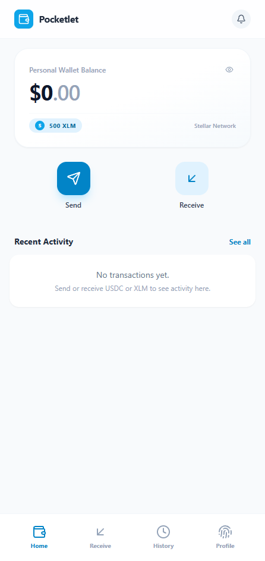
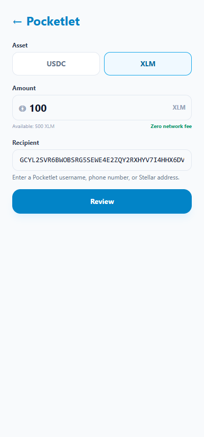
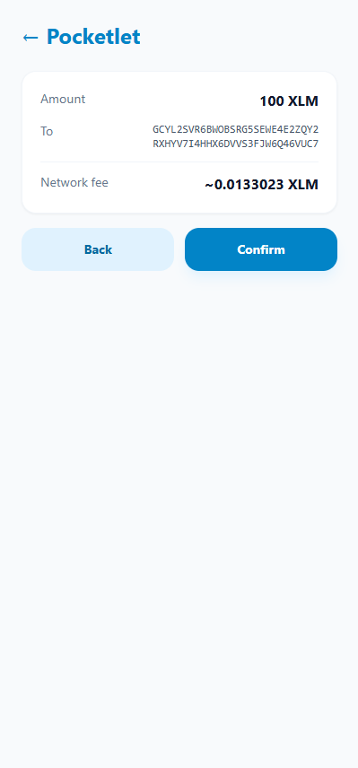
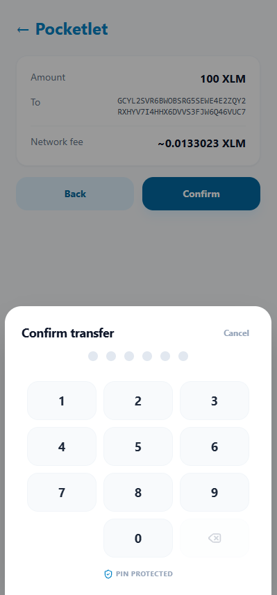
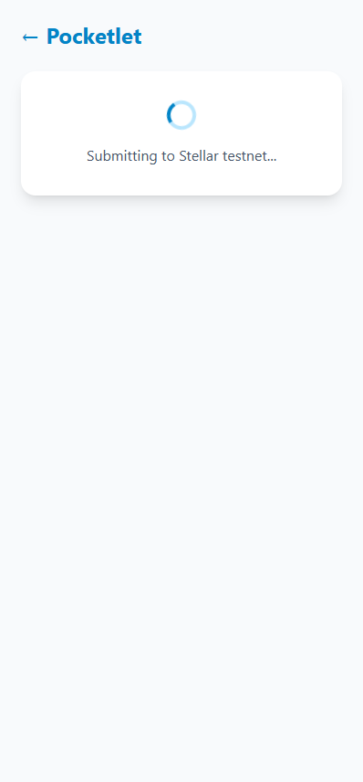
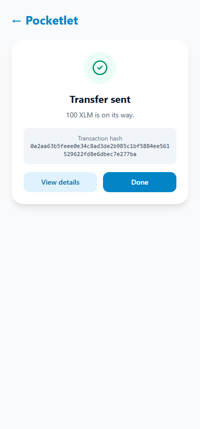
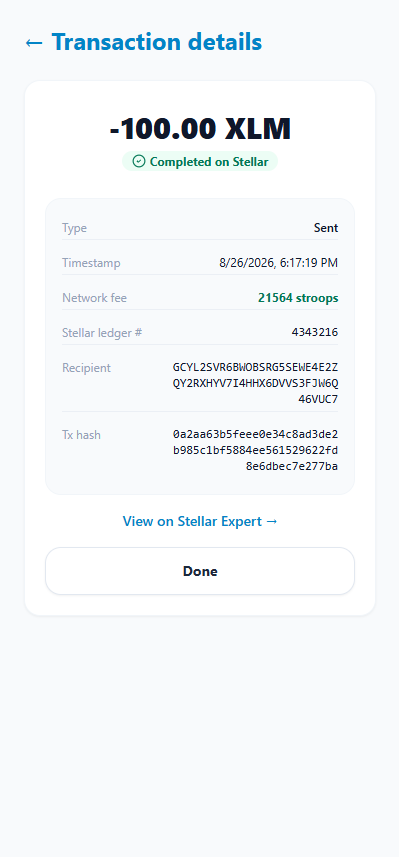
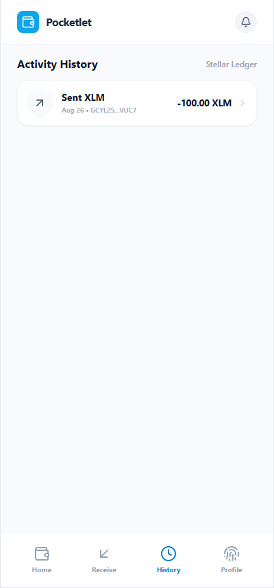
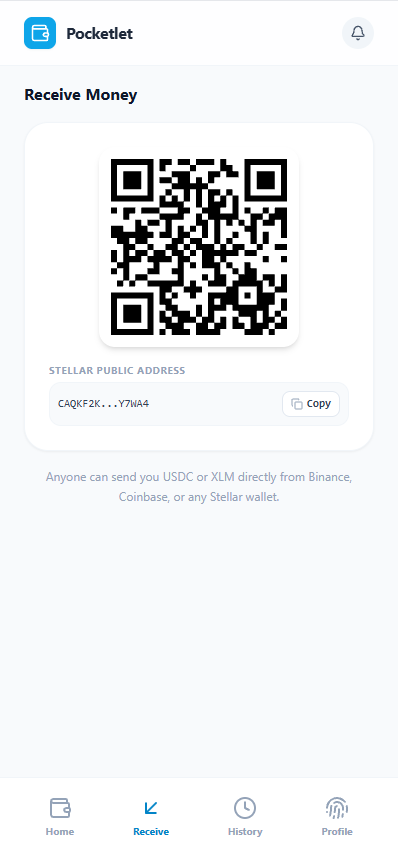
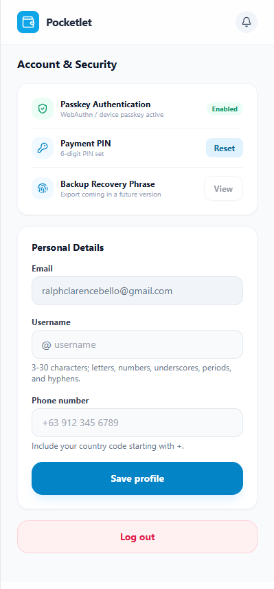

# Pocketlet

[](https://github.com/Valorthon/Pocketlet/actions/workflows/ci.yml?query=branch%3Adevelop)

Pocketlet is a web wallet for holding and sending digital dollars globally. It feels like a familiar money app, but settles on the Stellar blockchain. V1 runs on **Stellar Testnet**, supports USDC and XLM, and uses passkey-controlled Soroban smart wallets — the platform never holds user signing keys.

- **Live app (public testnet):** https://pocketlet.up.railway.app/
- **Demo video:** https://youtu.be/FPr7b7jgrFM
- **Documentation:** [`docs/`](./docs/README.md)

## Features

| Feature | Status |
| --- | --- |
| Email + passkey signup, with a client-generated BIP39 recovery phrase | Shipped |
| Passkey-controlled Soroban smart wallet (one per user) | Shipped |
| Receive USDC/XLM via address or QR code | Shipped |
| P2P transfers by username, phone, or raw Stellar address | Shipped |
| Claimable links — send to someone who has no wallet yet, via an escrow contract | **Broken** — creation still returns 400 ([#149](https://github.com/Valorthon/Pocketlet/issues/149)) and there is no refund UI. Claiming is fixed but unverified on chain. The cluster is written up in [production-readiness](./docs/production-readiness.md#claimable-links-do-not-work-end-to-end--open) |
| Email notification to a claim-link recipient | Shipped |
| SMS notification to a claim-link recipient | **Not shipped** — the row is recorded as `unsupported` and nothing is sent; needs an SMS provider ([production-readiness](./docs/production-readiness.md)) |
| PIN confirmation on all payments | Shipped — except claimable links, which take a passkey prompt instead, because the device key the PIN unlocks cannot authorize an escrow call ([#148](https://github.com/Valorthon/Pocketlet/issues/148)) |
| Device-key login (a short-lived Ed25519 signer, so routine sends need only a PIN) | Shipped |
| Lost-passkey recovery via recovery phrase or backup passkey | Shipped |
| Transaction history and on-chain detail view | Shipped |
| Admin dashboard (`/admin`, token-gated) | Shipped |
| USDC ↔ XLM swaps | **Deferred to V3** — the placeholder page and the `410` route were removed; the DEX integration has to be rebuilt for passkey-kit smart accounts ([roadmap](./docs/roadmap.md#cross-asset-swaps)) |

Feature status lives in this table only. Other docs link here rather than restating it.

## Quickstart

You need [Node.js 22+](https://nodejs.org/), [pnpm 11.13.1](https://pnpm.io/), and [Docker](https://docs.docker.com/get-docker/) (for Postgres). To build the smart contract you also need [Rust](https://rustup.rs/) and the [Stellar CLI](https://developers.stellar.org/docs/build/smart-contracts/getting-started/setup).

```bash
# 1. Start Postgres
docker compose up -d

# 2. Configure
cp apps/web/.env.example apps/web/.env.local

# 3. Install and run
pnpm install
pnpm run dev:web
```

Open http://localhost:3000. Migrations are applied automatically at startup.

> Passkeys are bound to an origin. Use `http://localhost:3000` exactly, or configure HTTPS with a matching `WEBAUTHN_RP_ID`.

Two variables in `.env.example` ship empty and **throw at runtime** if you exercise claimable links: `CLAIM_SECRET_ENCRYPTION_KEY` (generate with `openssl rand -hex 32`) and `NEXT_PUBLIC_ESCROW_CONTRACT_ID` (deploy the contract, below). Everything else works with the defaults. `.env.example` documents every variable.

## Project structure

```
apps/web/              Next.js 15 frontend + API routes (App Router)
packages/config/       Shared ESLint, TypeScript, Tailwind config
contracts/escrow/      Soroban claimable-link escrow contract (Rust)
docs/                  Project documentation — start at docs/README.md
demos/                 Static pitch-deck slides (not part of the app)
screenshots/           Images used by this README
.opencode/skills/      Vendored Stellar reference docs for coding agents
```

`AGENTS.md` (symlinked as `CLAUDE.md`) is the operating manual for coding agents and new developers — stack, commands, conventions, and known landmines.

## Common commands

```bash
pnpm run dev:web            # Start the web app in dev mode
pnpm run build:web          # Build the Next.js app
pnpm run start:web          # Start the production build
pnpm --filter web test      # Run frontend unit tests (requires Postgres running)
pnpm run lint               # ESLint
pnpm run typecheck          # tsc --noEmit
pnpm --filter web db:studio # Browse the database
pnpm run deploy:contract    # Build and deploy the escrow contract to testnet
```

Tests need a live Postgres — run `docker compose up -d` first. See [`docs/testing.md`](./docs/testing.md).

### Building the contract

```bash
cd contracts
stellar contract build
```

This produces `target/wasm32v1-none/release/pocketlet_escrow.wasm`. See [`contracts/escrow/README.md`](./contracts/escrow/README.md) for the contract interface.

## Architecture

A short version; the full picture with a diagram is in [`docs/architecture.md`](./docs/architecture.md).

- **Smart wallet** — `passkey-kit` deploys a passkey-controlled Soroban smart wallet per user. The primary signer is a WebAuthn credential (Secp256r1).
- **Recovery** — a BIP39 phrase (Stellar path `m/44'/148'/0'`) generated client-side and never sent to the server, plus an optional backup passkey.
- **Fee payer** — a server-held account rebuilds user-authorized `invoke_host_function` operations with itself as source, re-simulates for current resource fees, signs, and submits to Soroban RPC. It pays network fees and is **not** a signer on any user wallet.
- **Balances** — read from the USDC and XLM Stellar Asset Contracts via passkey-kit's `SACClient`.
- **Claimable links** — funds go into the escrow contract against a hashed secret; the recipient claims with the secret, or the sender refunds after expiry.
- **Storage** — PostgreSQL via Drizzle ORM; the schema and its caveats are in [`apps/web/src/lib/db/schema.ts`](./apps/web/src/lib/db/schema.ts).

## Deployed contracts (Testnet)

| Contract | Address |
| --- | --- |
| Circle USDC SAC | `CBIELTK6YBZJU5UP2WWQEUCYKLPU6AUNZ2BQ4WWFEIE3USCIHMXQDAMA` |
| Pocketlet escrow | Set `NEXT_PUBLIC_ESCROW_CONTRACT_ID` — printed in the CD workflow summary, or by `pnpm run deploy:contract` |

User smart wallets are deployed per account at runtime and derived from `NEXT_PUBLIC_WALLET_WASM_HASH`.

## Deployment

The web app runs on [Railway](https://railway.app/) from `Dockerfile` + `railway.json`. There are two deployments, both on **Stellar Testnet** — an internal one from the `stag-test` branch and the public one above from `prod-test`. The escrow contract is deployed to testnet by CI from `stag-test`.

**Mainnet is not supported.** Branch model, workflow triggers, and rollback are documented in [`CONTRIBUTING.md`](./CONTRIBUTING.md) and [`docs/operations.md`](./docs/operations.md).

## Security

V1 is a testnet technology interface. It does not custody funds, perform KYC, or process fiat. User funds live in each user's own smart wallet, and the platform never holds signing keys.

Known testnet shortcuts that must be closed before mainnet — including the file-backed testnet fee-payer key — are tracked in [`docs/production-readiness.md`](./docs/production-readiness.md). Reporting policy is in [`SECURITY.md`](./SECURITY.md).

## Screenshots

### Home



### Send flow








### History



### Receive



### Profile



## License

Proprietary — all rights reserved. See [`LICENSE`](./LICENSE). Public visibility is not a grant of rights.
